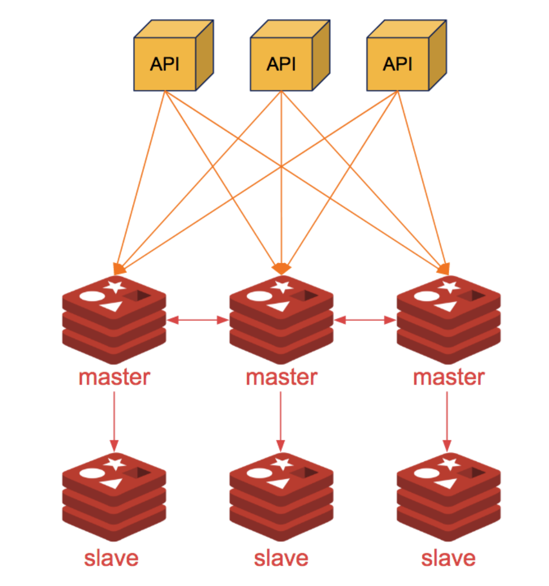

# Redis Cluster Example



# Document 

- [https://redis.io/topics/cluster-tutorial](https://redis.io/topics/cluster-tutorial)
- [Cluster Command](https://redis.io/commands/cluster-addslots)

# Requires

- Server : 6 Nodes 
  - 3 Masters
  - 3 Slaves 
- OS : Ubuntu 18.04 LTS

# Install

### All Nodes (6 Nodes)
1. Clone this Source Code

```sh
$ git clone https://github.com/jittagornp/redis-cluster-example.git
$ cd redis-cluster-example
$ chmod +x *.sh
```

2. Install Docker

```sh
$ ./install-docker.sh
```

3. Install Redis 

> *** Don't forget change redis password in this file before execute
```
$ ./docker-run-redis.sh 
```

### On Node 1

1. Change Node IP Address in file 
```sh
vi redis-cluster-example/docker-run-redis-cluster.sh
```

2. Create Cluster 
```sh
$ ./docker-run-redis-cluster.sh
```

# Test 

1. Remote to container 
```sh
$ docker exec -it redis bash 
```

2. Use Redis CLI 
```sh
$ redis-cli -c -h <NODE_IP> -p 6379 -a <YOUR_REDIS_PASSWORD> 
> cluster nodes 
```
